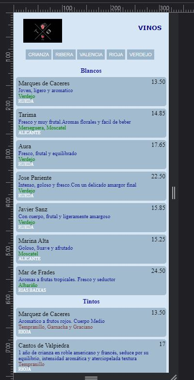
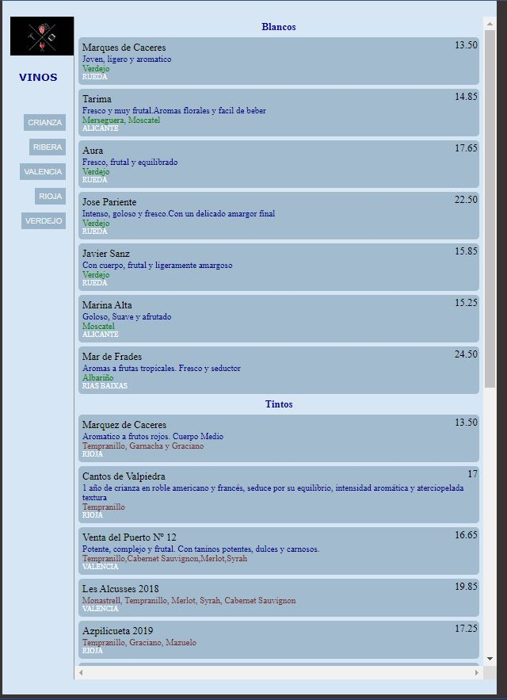

# Wine List One
 A wine list with filtering buttons. These buttons 'on click' will shows a filtered list by e.g. 'aged wines'.
 This basic web page uses as UI base [Wine-List-UI](https://github.com/edocybdezad/Wine-List-UI.git).
 

## Installation
- Use the code tab to download the zip file. 

## Usage

- Unzip the folder and run the file index.html using Live Server or similar. VScode has Live Server extension by default.

## Technologies
- HTML
- CSS
- JavaScript

## Screnshot

